⚠️ **Never Cross These Lines**:  
- Fake GPS/spoofing  
- Multiple accounts  
- Post-pickup cancellations  
- Tip manipulation  
*Consequence: Instant deactivation & forfeited earnings.*

---

### **II. Strategic Scheduling & Positioning**  
#### **A. Peak Timing**  
| **Shift**              | **Key Locations**         | **Earnings Boost**       |  
|------------------------|---------------------------|--------------------------|  
| **Lunch** (10:30a-1:30p)| Business districts        | +20% base pay (all apps) |  
| **Dinner** (5p-9p)     | Affluent suburbs          | $3–$5 surge/order        |  
| **Late-Night** (10p-2a)| Urban cores/college areas | 1.8x–2.5x multipliers    |  

**Pro Tactics**:  
- Track local events (concerts/sports) via **Gridwise** for 2x+ surges.  
- Grubhub: Schedule blocks **3 days in advance** for guaranteed $15–$22/hr contribution pay.  

#### **B. Zone Optimization**  
| **App**       | **Strategy**                                  | **Income Impact**        |  
|---------------|-----------------------------------------------|--------------------------|  
| **DoorDash**  | Maintain 70%+ AR + 95% CR for "Top Dasher"    | $4.75+/order, dash anytime |  
| **Uber Eats** | Cluster near "Platinum" restaurants (app heatmap) | +30% order volume      |  
| **Grubhub**   | Work scheduled blocks only                    | Priority on $8+ orders    |  

---

### **III. Order Selection Algorithm**  

```mermaid
flowchart TD
    A[Offer] --> B{≥ $1.50/mile?}
    B -->|Yes| C{≥ $6 payout?}
    B -->|No| D[Decline]
    C -->|Yes| E{≤15min drive?}
    C -->|No| D
    E -->|Yes| F[Accept]
    E -->|No| G{Surge/Promo?}
    G -->|+$3+| F
    G -->|No| D
```

**Key Rejection Criteria**:  
- Non-tipped orders (base pay ≤ $3)  
- Stacked orders under $12  
- Mall/campus orders during rushes  

**High-Value Targets**:  
- **Catering orders**: 15–25% tips (DoorDash "Large Order" tag)  
- **Alcohol/retail**: Higher base pay (Uber Eats)  
- **Grocery**: $18–25/hr (Instacart/Shipt)  

---

### **IV. Multi-Apping Safely**  
**Golden Rules**:  
1. **Never accept concurrent offers** unless:  
   - Drop-offs < 0.5 miles apart  
   - Combined prep time ≤ 8 minutes  
2. **Priority Sequence**:  
   Grubhub blocks > Uber surge > DoorDash Peak Pay  
3. **Tool Stack**:  
   - Para (auto-declines low orders)  
   - Stride (auto-mileage tracking)  
   - Separate thermal bags per app  

---

### **V. Incentive Stacking**  
| **Platform**   | **Best Incentives**       | **Maximization Strategy**       |  
|----------------|---------------------------|---------------------------------|  
| DoorDash       | Peak Pay ($1–$4+/order)   | Schedule *only* in colored zones |  
| Uber Eats      | Quests ($50–$150)         | Complete 90%+ of target orders   |  
| Grubhub        | Contribution pay          | Work 100% of scheduled blocks    |  

**Pro Move**: Stack Uber "Quests" + DoorDash "Challenges" during holidays for +$200/day.  

---

### **VI. Cost & Risk Mitigation**  
#### **A. Expenses**  
- **Deductions**: $0.67/mile (2025), phone bill, gear (track via Stride)  
- **Fuel**: Use Upside/GasBuddy + Costco (DoorDash partnership: $0.07/gal off)  
- **Maintenance**: Oil changes every 5k miles; check tire pressure weekly  

#### **B. Deactivation Defense**  
- **Ratings**: Keep >4.7 (send thank-you texts via Driver Utility Helper)  
- **Tip-Baiting**: Screenshot high-tip Uber orders pre-delivery; report offenders  
- **Cancellations**: Never cancel post-pickup (all apps)  

---

### **VII. Community-Proven Tactics**  
- **Hotspots**: Ignore in-app "busy areas" – park near **Chipotle/Starbucks** clusters instead.  
- **Ghost Kitchens**: Prioritize virtual brands (MrBeast Burger, Cosmic Wings) – faster prep, higher volume.  
- **Weather Arbitrage**: Work during heavy rain/snow for 2x pay (Uber "Storm Mode").  

---

### **VIII. Earnings Potential**  
| **Scenario**       | **Hourly**  | **Weekly (50h)** | **Key Drivers**                     |  
|--------------------|-------------|------------------|-------------------------------------|  
| **Weekday Base**   | $18–$25     | $900–$1,250      | Strategic scheduling + order filtering |  
| **Weekend Surge**  | $30–$45     | $1,500–$2,250    | Event-driven surges + multi-apping  |  
| **Top 10%**        | $35–$50+    | $1,800–$2,500    | Incentive stacking + premium blocks |  

> 💡 **Realistic Benchmark**: $1,200–$1,800/week achievable in metros working 50–60h using these tactics.

---

### **Toolkit for Success**  
- **Apps**: Gridwise (surge forecasting), Para (order analytics), Stride (taxes)  
- **Communities**: Reddit r/couriersofreddit, Facebook "Delivery Driver Best Practices"  
- **Learning**: Uber Eats "Pro" training, DoorDash "Top Dasher" webinars  

**Final Tip**: Track every delivery for 2 weeks in a spreadsheet. Optimize for:  
- $/mile (min $1.50)  
- $/active hour (min $25)  
- Peak hour ROI (dinner > lunch)
